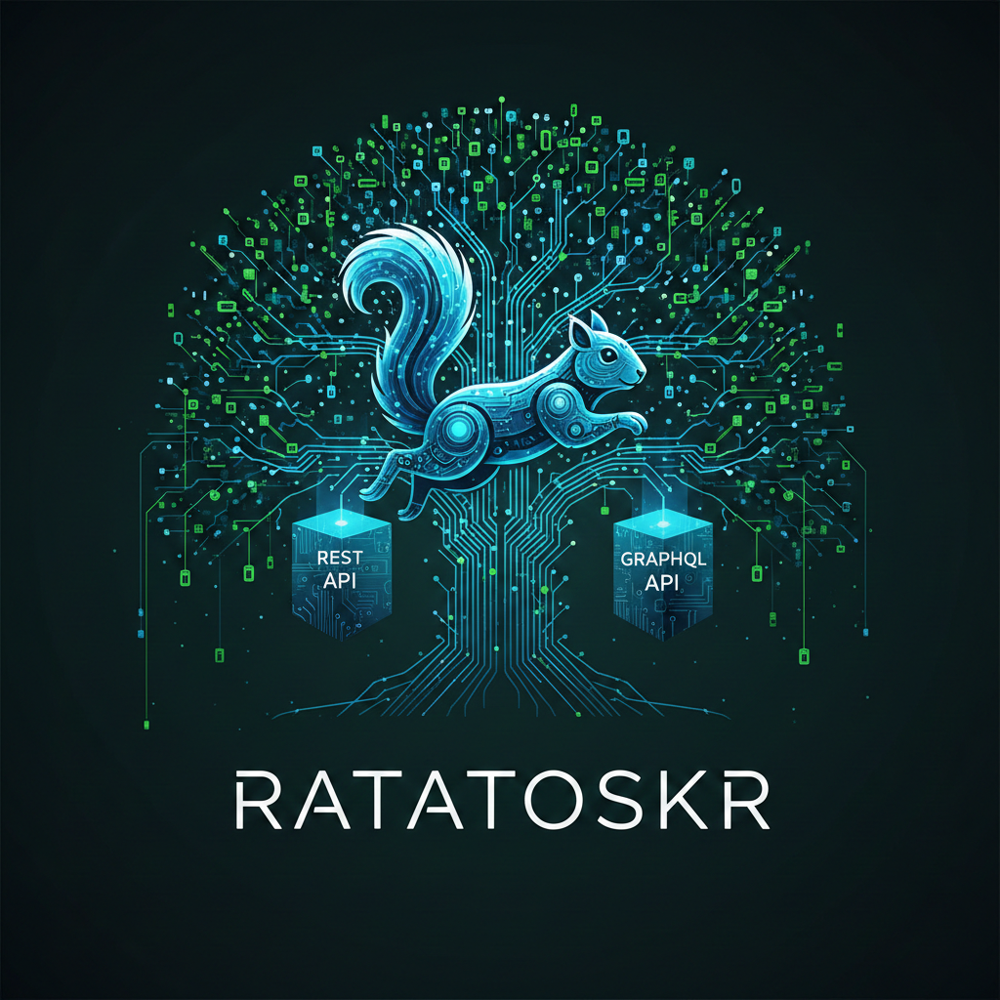
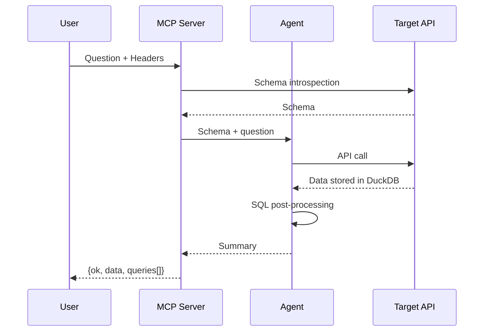
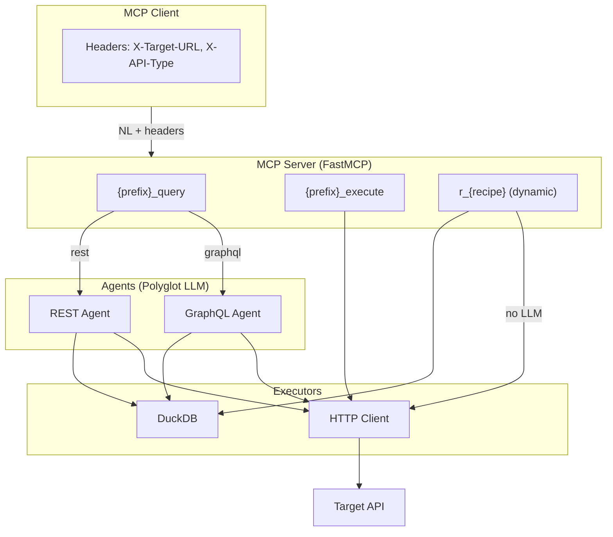
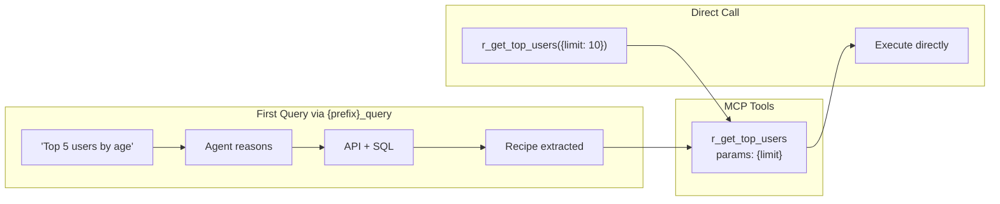

<p align="center">
  
</p>

<h1 align="center">Ratatoskr</h1>

<p align="center">
  <strong>Turn any API into an MCP server. Query in English. Get results — even when the API can't.</strong>
</p>

<p align="center">
  <a href="#quick-start">Quick Start</a> &middot;
  <a href="#how-it-works">How It Works</a> &middot;
  <a href="#providers">Providers</a> &middot;
  <a href="#reference">Reference</a> &middot;
  <a href="#development">Development</a>
</p>

---

> **Ratatoskr** is a polyglot-LLM fork of [agoda-com/api-agent](https://github.com/agoda-com/api-agent) — Agoda's universal API-to-MCP bridge. This fork adds first-class **Anthropic** and **OpenAI-compatible** (Ollama, LM Studio, vLLM) provider support alongside the original OpenAI backend. All credit for the core architecture goes to the [Agoda engineering team](https://medium.com/agoda-engineering/how-to-convert-any-api-to-mcp-with-zero-code-and-zero-deployments-using-apiagent-fa494de8eaee).

---

Point at any GraphQL or REST API. Ask questions in natural language. The agent fetches data, stores it in DuckDB, and runs SQL post-processing. Rankings, filters, JOINs work **even if the API doesn't support them**.

## What Makes It Different

**Zero config.** No custom MCP code per API. Point at a GraphQL endpoint or OpenAPI spec — schema introspected automatically.

**SQL post-processing.** API returns 10,000 unsorted rows? Agent ranks top 10. No GROUP BY? Agent aggregates. Need JOINs across endpoints? Agent combines.

**Safe by default.** Read-only. Mutations blocked unless explicitly allowed.

**Recipe learning.** Successful queries become cached pipelines. Reuse instantly without LLM reasoning.

**Polyglot LLM.** Run with OpenAI, Anthropic (Claude), or any OpenAI-compatible endpoint — same capabilities, your choice of model.

## Quick Start

**1. Run (choose one):**

```bash
# OpenAI (default)
OPENAI_API_KEY=your_key uv run api-agent

# Anthropic (Claude)
uv run api-agent --provider anthropic --api-key your_key

# Local model (Ollama, LM Studio, vLLM)
uv run api-agent --provider openai-compat --base-url http://localhost:11434/v1 --model llama3

# Or Docker (OpenAI)
docker build -t ratatoskr .
docker run -p 3000:3000 -e OPENAI_API_KEY=your_key ratatoskr
```

**2. Add to any MCP client:**
```json
{
  "mcpServers": {
    "rickandmorty": {
      "url": "http://localhost:3000/mcp",
      "headers": {
        "X-Target-URL": "https://rickandmortyapi.com/graphql",
        "X-API-Type": "graphql"
      }
    }
  }
}
```

**3. Ask questions:**
- *"Show characters from Earth, only alive ones, group by species"*
- *"Top 10 characters by episode count"*
- *"Compare alive vs dead by species, only species with 10+ characters"*

That's it. Agent introspects schema, generates queries, runs SQL post-processing.

## More Examples

**REST API (Petstore):**
```json
{
  "mcpServers": {
    "petstore": {
      "url": "http://localhost:3000/mcp",
      "headers": {
        "X-Target-URL": "https://petstore3.swagger.io/api/v3/openapi.json",
        "X-API-Type": "rest"
      }
    }
  }
}
```

**Your own API with auth:**
```json
{
  "mcpServers": {
    "myapi": {
      "url": "http://localhost:3000/mcp",
      "headers": {
        "X-Target-URL": "https://api.example.com/graphql",
        "X-API-Type": "graphql",
        "X-Target-Headers": "{\"Authorization\": \"Bearer YOUR_TOKEN\"}"
      }
    }
  }
}
```

---

## How It Works



## Architecture



**Stack:** [FastMCP](https://github.com/jlowin/fastmcp) &middot; [OpenAI](https://platform.openai.com/docs) / [Anthropic](https://docs.anthropic.com) / OpenAI-compatible &middot; [DuckDB](https://duckdb.org)

---

## Recipe Learning

Agent learns reusable patterns from successful queries:

1. **Executes** — API calls + SQL via LLM reasoning
2. **Extracts** — LLM converts trace into parameterized template
3. **Caches** — Stores recipe keyed by (API, schema hash)
4. **Exposes** — Recipe becomes MCP tool (`r_{name}`) callable without LLM



Recipes auto-expire on schema changes. Disable with `API_AGENT_ENABLE_RECIPES=false`.

---

## Providers

Ratatoskr supports multiple LLM providers through a thin abstraction layer.

### OpenAI (default)

```bash
OPENAI_API_KEY=sk-... uv run api-agent
```

### Anthropic (Claude)

```bash
# Via CLI
uv run api-agent --provider anthropic --api-key sk-ant-...

# Via env vars
API_AGENT_PROVIDER=anthropic ANTHROPIC_API_KEY=sk-ant-... uv run api-agent

# Custom model
uv run api-agent --provider anthropic --model claude-opus-4-20250514
```

### Local Models (Ollama, LM Studio, vLLM)

```bash
# Ollama
uv run api-agent --provider openai-compat \
  --base-url http://localhost:11434/v1 \
  --model llama3

# LM Studio
uv run api-agent --provider openai-compat \
  --base-url http://localhost:1234/v1 \
  --model local-model

# vLLM
uv run api-agent --provider openai-compat \
  --base-url http://gpu-server:8000/v1 \
  --model mistral-7b
```

> **Note:** Local models must support tool/function calling for full functionality.
> If an endpoint doesn't support tools, the agent will retry without them (graceful degradation).

---

## Reference

### Headers

| Header                 | Required | Description                                                |
| ---------------------- | -------- | ---------------------------------------------------------- |
| `X-Target-URL`         | Yes      | GraphQL endpoint OR OpenAPI spec URL                       |
| `X-API-Type`           | Yes      | `graphql` or `rest`                                        |
| `X-Target-Headers`     | No       | JSON auth headers, e.g. `{"Authorization": "Bearer xxx"}`  |
| `X-API-Name`           | No       | Override tool name prefix (default: auto-generated)        |
| `X-Base-URL`           | No       | Override base URL for REST API calls                       |
| `X-Allow-Unsafe-Paths` | No       | Header string containing JSON array of `fnmatch` globs (`*`, `?`) for POST/PUT/DELETE/PATCH |
| `X-Poll-Paths`         | No       | Header string containing JSON array of polling path patterns (enables poll tool) |
| `X-Include-Result`     | No       | Include full uncapped `result` field in output             |
| `X-Allow-Endpoints`    | No       | JSON array of glob patterns to restrict exposed endpoints  |

#### Header value examples

`X-Allow-Unsafe-Paths` and `X-Poll-Paths` use the same escaping format: JSON array encoded as a header string.

**MCP config (JSON):**
```json
{
  "headers": {
    "X-Allow-Unsafe-Paths": "[\"/search\", \"/api/*/query\", \"/jobs/*/cancel\"]",
    "X-Poll-Paths": "[\"/search\", \"/trips/*/status\"]"
  }
}
```

**`X-Allow-Unsafe-Paths` pattern examples:**
- `"/search"` exact path
- `"/api/*/query"` one wildcard segment
- `"/jobs/*"` any suffix under `/jobs/`

**`X-Poll-Paths` pattern examples:**
- `"/search"` exact polling path
- `"/trips/*/status"` wildcard polling path

`X-Poll-Paths` enables polling guidance/tooling; `X-Allow-Unsafe-Paths` controls unsafe method allowlist.

**Escaping quick check (same for both headers):**
- wrong: `"X-Allow-Unsafe-Paths": "["/search"]"`
- right: `"X-Allow-Unsafe-Paths": "[\"/search\"]"`

### MCP Tools

**Core tools** (2 per API):

| Tool               | Input                                                          | Output                          |
| ------------------ | -------------------------------------------------------------- | ------------------------------- |
| `{prefix}_query`   | Natural language question                                      | `{ok, data, queries/api_calls}` |
| `{prefix}_execute` | GraphQL: `query`, `variables` / REST: `method`, `path`, params | `{ok, data}`                    |

Tool names auto-generated from URL (e.g., `example_query`). Override with `X-API-Name`.

**Recipe tools** (dynamic, added as recipes are learned):

| Tool               | Input                              | Output |
| ------------------ | ---------------------------------- | ------ |
| `r_{recipe_slug}`  | flat recipe-specific params, `return_directly` (bool) | CSV or `{ok, data, executed_queries/calls}` |

Cached pipelines, no LLM reasoning. Appear after successful queries. Clients notified via `tools/list_changed`.

### CLI Arguments

| Argument       | Description                                              |
| -------------- | -------------------------------------------------------- |
| `--provider`   | LLM provider: `openai`, `anthropic`, or `openai-compat`  |
| `--model`      | Model name (default: provider-specific)                  |
| `--api-key`    | API key (overrides env vars)                             |
| `--base-url`   | Custom LLM endpoint (required for `openai-compat`)       |
| `--port`       | Server port (default: 3000)                              |
| `--host`       | Server host (default: 0.0.0.0)                           |
| `--transport`  | MCP transport: `http`, `streamable-http`, `sse`           |
| `--debug`      | Enable debug logging                                     |

CLI arguments override environment variables.

### Configuration (env vars)

| Variable                       | Required | Default                   | Description                        |
| ------------------------------ | -------- | ------------------------- | ---------------------------------- |
| `API_AGENT_PROVIDER`           | No       | `openai`                  | LLM provider (`openai`, `anthropic`, `openai-compat`) |
| `API_AGENT_API_KEY`            | **Yes**  | -                         | API key (also accepts `OPENAI_API_KEY`, `ANTHROPIC_API_KEY`) |
| `API_AGENT_BASE_URL`           | No*      | -                         | Custom LLM endpoint (*required for `openai-compat`) |
| `API_AGENT_MODEL_NAME`         | No       | (provider default)        | Model name                         |
| `API_AGENT_PORT`               | No       | 3000                      | Server port                        |
| `API_AGENT_ENABLE_RECIPES`     | No       | true                      | Enable recipe learning & caching   |
| `API_AGENT_RECIPE_CACHE_SIZE`  | No       | 64                        | Max cached recipes (LRU eviction)  |
| `API_AGENT_ALLOW_ENDPOINTS_REST` | No     | -                         | CSV glob patterns for REST endpoint allowlist |
| `API_AGENT_ALLOW_ENDPOINTS_GRAPHQL` | No  | -                         | CSV glob patterns for GraphQL endpoint allowlist |
| `API_AGENT_ALLOW_ENDPOINTS_GRPC` | No     | -                         | CSV glob patterns for gRPC endpoint allowlist |
| `OTEL_EXPORTER_OTLP_ENDPOINT`  | No       | -                         | OpenTelemetry tracing endpoint     |

**Provider defaults:**

| Provider        | Default model               | API key env var     |
| --------------- | --------------------------- | ------------------- |
| `openai`        | `gpt-4o`                    | `OPENAI_API_KEY`    |
| `anthropic`     | `claude-sonnet-4-20250514`  | `ANTHROPIC_API_KEY` |
| `openai-compat` | `gpt-4o`                    | (optional)          |

---

## Endpoint Allowlisting

Large APIs (500+ endpoints) can overwhelm LLM context. Endpoint allowlisting filters schemas **before the LLM sees them**, so agents only operate on permitted endpoints.

### Config (ops ceiling)

Set per-protocol env vars with comma-separated [fnmatch](https://docs.python.org/3/library/fnmatch.html) glob patterns:

```bash
API_AGENT_ALLOW_ENDPOINTS_REST="GET /users/*,GET /accounts/*"
API_AGENT_ALLOW_ENDPOINTS_GRAPHQL="Query.users*,Query.accounts*"
API_AGENT_ALLOW_ENDPOINTS_GRPC="myapp.UserService/*,myapp.AccountService/*"
```

### Per-session header (narrows config)

Clients send `X-Allow-Endpoints` as a JSON array of glob patterns:

```json
{ "X-Allow-Endpoints": "[\"GET /users/*\"]" }
```

**Intersection semantics:** When both config and header are set, an endpoint must match a pattern from **each**. The header can only narrow the config ceiling, never widen it.

### Match target format

| Protocol | Format | Examples |
| -------- | ------ | -------- |
| REST     | `METHOD /path` | `GET /users/*`, `POST /search`, `* /api/v2/*` |
| GraphQL  | `Query.fieldName` | `Query.users`, `Query.account*` |
| gRPC     | `package.Service/Method` | `myapp.UserService/*`, `myapp.*/Get*` |

### Behavior

- **No config + no header** = all endpoints exposed (default)
- **Allowlist active, some match** = agent sees only matching endpoints
- **Allowlist active, none match** = clear error returned (agent does not run)
- **`search_schema()`** operates on the filtered schema — blocked endpoints are invisible

---

## Roadmap

Planned improvements (contributions welcome):

- [ ] **Streaming responses** — Stream agent reasoning and partial results to MCP clients
- [ ] **Mutation support** — Controlled write operations with confirmation flows
- [ ] **Schema caching** — Cache introspected schemas to reduce startup latency
- [ ] **Multi-API joins** — Query across multiple APIs in a single request
- [ ] **Recipe sharing** — Export/import learned recipes between instances
- [ ] **WebSocket subscriptions** — Support GraphQL subscriptions for real-time data
- [ ] **Plugin system** — Custom pre/post-processing hooks for API responses

## Development

```bash
git clone https://github.com/innago-property-management/ratatoskr.git
cd ratatoskr
uv sync --group dev
uv run pytest tests/ -v      # Tests (848 passing)
uv run ruff check api_agent/  # Lint
uv run ty check               # Type check
```

## Observability

Set `OTEL_EXPORTER_OTLP_ENDPOINT` to enable OpenTelemetry tracing. Works with Jaeger, Zipkin, Grafana Tempo, Arize Phoenix.

---

## Origin & Attribution

Ratatoskr is a fork of **[api-agent](https://github.com/agoda-com/api-agent)** by [Agoda](https://github.com/agoda-com), licensed under the [MIT License](LICENSE).

The core architecture — FastMCP server, dynamic tool naming, agent orchestration, DuckDB post-processing, and recipe learning — is entirely Agoda's work. Ratatoskr extends it with:

- **Polyglot LLM support** — Anthropic, OpenAI, and OpenAI-compatible providers via a pluggable `LLMProvider` abstraction
- **Expanded test coverage** — 848 tests covering orchestration, safety boundaries, configuration contracts, and provider SDK surfaces
- **GraphQL partial success fix** — Returns both `data` and `errors` when both present, per the GraphQL specification

The name **Ratatoskr** comes from the Norse squirrel who runs up and down Yggdrasil carrying messages between realms — a fitting metaphor for a universal API-to-LLM bridge.

**Upstream:** [agoda-com/api-agent](https://github.com/agoda-com/api-agent) &middot; [Blog post](https://medium.com/agoda-engineering/how-to-convert-any-api-to-mcp-with-zero-code-and-zero-deployments-using-apiagent-fa494de8eaee)
